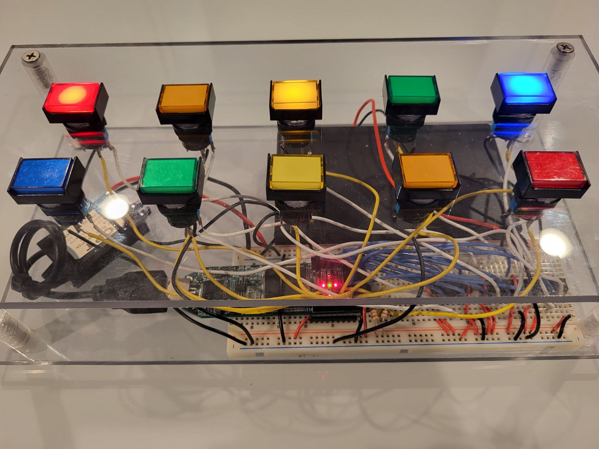

### program.s game interface


### Instructions used in program.s
``````
LDW - loads from work register into ram
STW - stores from ram into work register
MWO - sets output to work register
MIW - sets work register to input
CLW - sets work register to 0000
CLO - set output to 0000

INC - increments work register
SUB - subtracts value in ram from work register
XOR - xor ram with work register
AND - and ram with work register
RTL - rotates work register left
RTR - rotates work register right
BWS - sets bit in work register
BWC - clears bit in work register

JMP - jump
JPC - jumps if carry flag is set
JPZ - jumps if work register is set to 0000
BWJ - jumps 2 memory locations ahead if the specified bit in the work register is set
BIJ - jumps 2 memory locations if the specified bit in the input is set
RST - reset
``````
